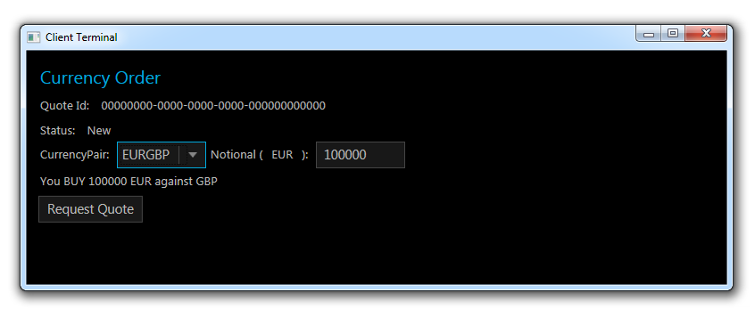
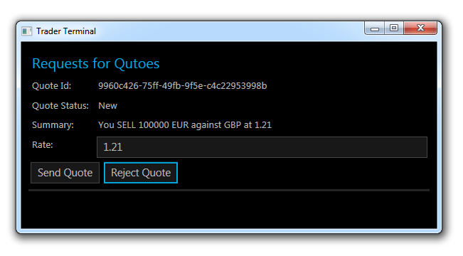

# Evented State Processor Reactive Model Example

This example shows a simplistic client/trader request for quote (RFQ) workflow.
The example has both a client and trader application built using the [reactive domain model approach](http://esp.readthedocs.org/en/latest/modeling-approaches/reactive-domain-model.html).
For simplicity both the client and trader apps run within the same process, middleware is fudged.

Client terminal allowing a users to buy some currency :

Trader terminal allow you to pick up an RFQ and send a quote to the client:

## Learning ESP

- [Documentation](http://esp.readthedocs.org/en/latest/)

### Get help from other users:

- [esp/chat on Gitter Chat](https://gitter.im/esp/chat)
- [Questions tagged esp on StackOverflow](http://stackoverflow.com/questions/tagged/esp)
- [GitHub Issues](https://github.com/esp/esp-net/issues)

*Let us [know](https://github.com/esp/esp-net/issues) if you discover anything worth sharing!*

## Running

Requires Visual Studio 2013 and .Net 4.5. 

Open the solution, restore the nuget packages and run up in the debugger (F5).